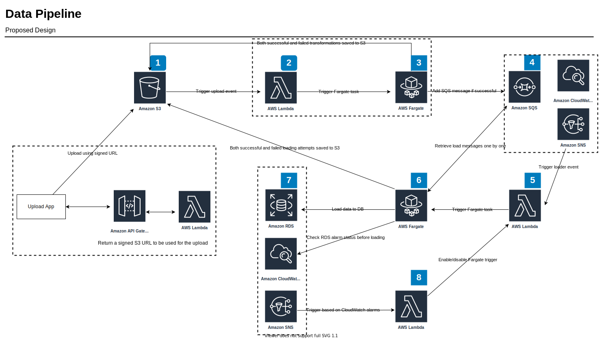

# Data Pipeline

This document describes the design of the data pipeline which import (optionally transform and/or sanitize) price data into the database.

# Table of Content
* [Assumptions and Considerations](#assumptions-and-considerations)
* [Solution Design](#solution-design)
  * [Components](#components)
     * [Component 1: File storage](#component-1-file-storage)
     * [Component 2: Data transformation Lambda trigger &amp; Component 3: Fargate task running the transformation](#component-2-data-transformation-lambda-trigger--component-3-fargate-task-running-the-transformation)
     * [Component 4: Data loader SQS queue](#component-4-data-loader-sqs-queue)
     * [Component 5: Lambda function which runs the data loader Fargate task](#component-5-lambda-function-which-runs-the-data-loader-fargate-task)
     * [Component 6: Data loader Fargate task](#component-6-data-loader-fargate-task)
     * [Component 7: Existing AWS RDS Postgres database](#component-7-existing-aws-rds-postgres-database)
* [Q&amp;A](#qa)
  * [How would you set up monitoring to identify bottlenecks as the load grows and how can those bottlenecks be addressed in the future?](#how-would-you-set-up-monitoring-to-identify-bottlenecks-as-the-load-grows-and-how-can-those-bottlenecks-be-addressed-in-the-future)
  * [The batch updates have started to become very large, but the requirements for their processing time are strict.](#the-batch-updates-have-started-to-become-very-large-but-the-requirements-for-their-processing-time-are-strict)
  * [Code updates need to be pushed out frequently. This needs to be done without the risk of stopping a data update already being processed, nor a data response being lost.](#code-updates-need-to-be-pushed-out-frequently-this-needs-to-be-done-without-the-risk-of-stopping-a-data-update-already-being-processed-nor-a-data-response-being-lost)
  * [For development and staging purposes, you need to start up a number of scaled-down versions of the system.](#for-development-and-staging-purposes-you-need-to-start-up-a-number-of-scaled-down-versions-of-the-system)
  * [Which parts of the system are the bottlenecks or problems that might make it incompatible with the new requirements?](#which-parts-of-the-system-are-the-bottlenecks-or-problems-that-might-make-it-incompatible-with-the-new-requirements)
  * [How would you restructure and scale the system to address those?](#how-would-you-restructure-and-scale-the-system-to-address-those)

# Assumptions and Considerations
1. The pipeline runs in the AWS cloud and there is no need to go for a cloud-agnostic solution right now
2. Containers are a strategic choice over standard virtual machines
3. On-demand over the long-running permanent process
4. Current agreed method of ingesting data is via files, support for direct database adaptors/streaming data not considered yet
5. Anyone (internal/external) should be able to upload data to the pipeline
6. Performance impact for the core business functionality must be within the acceptable range ( have not defined yet, some control must be in place for the moment )
7. Expect very little administration overhead as much as possible
8. AWS RDS is the database infrastructure platform and have read replicas enabled (better to have multi-az as well)

# Solution Design



## Components

### Component 1: File storage
AWS S3 will be used to store all the files uploaded and generated by the pipeline stages.
S3 offers high uptime and data durability and very cost-efficient.

We use only one S3 bucket to store all the files, and self-describing prefixes will be used to differentiate each type of file.
Proposed file structure is,
```
<bucket root>/
    uploads/
        YYYY/MM/DD/<unixtimestamp>.<extension>
    transform/
        good/
            YYYY/MM/DD/<unixtimestamp>.<extension>
        bad/
            YYYY/MM/DD/<unixtimestamp>.<extension>
            YYYY/MM/DD/<unixtimestamp>.<extension>.log
    load/
        good/
            YYYY/MM/DD/<unixtimestamp>.<extension>
        bad/
            YYYY/MM/DD/<unixtimestamp>.<extension>
            YYYY/MM/DD/<unixtimestamp>.<extension>.log
```
From start to end, files will be `moved` to the relevant directory structure. If there is a failure in any of the stages,
we can examine and resume the process using the files in `bad` directories.

When a file uploaded to the upload directory, AWS S3 generates an event notification which triggers a Lambda function to start
the data transformation process if enabled ( component 2 ) or directly push the message to the data loader queue ( component 4 ).

We can set up SNS based email alerts when files delivered to `bad` directories using AWS S3 events. 

### Component 2: Data transformation Lambda trigger & Component 3: Fargate task running the transformation
If we enable incoming data transformations and/or sanitization step, we can use these two components to create an on-demand cost-effective
transformation/sanitization stage. The Lambda function creates an on-demand AWS Fargate task and initiates the process.
Multiple transformations can run concurrently by design.

The Fargate task moves the processed file to either `transform/good` or `transform/bad` S3 ( component 1 ) directory based on
the outcome of the process. After a successful process, the processed file will be moved to `transform/good` and adds a message to
the data loader queue ( component 4 ) before terminating the process which in turn terminates the Fargate task.

Any data that failed to transform/sanitize will be recorded separately into a log file along with any verbose output to debug
process issues. The main process must handle all exceptions and must not allow the process to exit prematurely.
After a failed process, the log file, and the data file will be moved to the `transform/bad` directory and exit the container process.

### Component 4: Data loader SQS queue
This queue contains all the uploads which are ready to be loaded into our RDS database. To ensure sequential execution of the loading
tasks and to make the loader process on-demand, Amazon CloudWatch will be used to monitor the current queue size and if the queue size
if greater than 1 for a defined period ( 10 sec, 30 sec, 1 min, 5 min, etc. ) an alarm will be raised which will raise an
AWS SNS notification triggers a Lambda function ( component 5 ) to start the loader process.

### Component 5: Lambda function which runs the data loader Fargate task
This function creates a Fargate task to run the data loading process. By design, this function creates only one Fargate task
and if there is a running Fargate task available, the Lambda does nothing. This behavior ensures that we run only one data
loading task at a given time.

### Component 6: Data loader Fargate task
This task loads data into the RDS database. When the task started by the Lambda trigger, it will check and drain all SQS messages
in the data loader task queue ( component 4 ). For each message, the task will,
- Run the data loading process
- Move uploaded or transformed data files ( if transformation enabled ) to the `load` directory based on the outcome of the loading task
- Add logs of the loading process to the relevant `load/bad` directory if it has failed
- Adds a defined delay before the next loading task
- Execute the next loading task

The data loader can check with the RDS CloudWatch alarms/metrics for any performance impacts and delay the loading tasks
dynamically to reduce the impact on the core business functionality. A maximum waiting time limit must be set to ensure that the task
does not wait indefinitely to execute the loading tasks.

The loader will try to execute all the pending data loading tasks before exiting unless it cannot continue due to a situational
impact to the database measured using the CloudWatch alarm status(es) and metrics.

### Component 7: Existing AWS RDS Postgres database
Read replicas MUST be enabled. Performance-related CloudWatch alarms will be created using the available metrics in CloudWatch.
We can enable SNS notifications to notify us of any performance issues, and optionally set up an SNS notification to trigger
a Lambda function ( component 8 ) that enables/disables the Lambda function ( component 5 ) that runs the data loader Fargate task.
If setup, it will ensure that the data loading Fargate task will not be run unnecessarily when there is an ongoing issue with the database.
Furthermore, it can act as a circuit breaker for the operations team to temporarily disable data loading tasks.

We MUST ensure that any application that reads the data from the database uses the read replicas instead of the master database if they can
tolerate a couple of seconds of stale data until the asynchronous replication catches up with the master.
Master database MUST be used exclusively for write operations and any reads that require the latest up-to-date data.

By default, AWS RDS provides two database URLs for an RDS cluster,
- One for the master that support read/write
- One for slaves that support read-only

We should ensure that we use the endpoints sensibly in our code so that we do not send every query to the master.
Doing so ensures that the core business systems keep running within expected performance guidelines and are minimally affected by the
sudden data loading activities. 

# Q&A

## How would you set up monitoring to identify bottlenecks as the load grows and how can those bottlenecks be addressed in the future?

- Resource usage of the Fargate tasks will be monitored using either CloudWatch or a third-party monitoring solution (ie: DataDog).
This ensures that we are up-to-date with the resource related bottlenecks in the system so that we can make adjustments to the tasks
to ensure smooth operation.
- RDS database MUST be monitored at all the time, all sensible metrics must be monitored and visualized
- Process logs will be analyzed for any timeouts, connectivity issues
- Better to collect statistics of the jobs such as file size, the number of records, time took to transform/sanitize data files, time took to
load the data files into the database, etc. so that we can identify any emerging patterns which can be indications of a degrading system. ie:
increased data loading times may indicate that the database is going into a degraded state.
- Learn from the mistakes and incidents - keep refining monitoring and alerting

## The batch updates have started to become very large, but the requirements for their processing time are strict.

Any data loading process which has high priority can be sent to a priority job queue, and the data loader task will execute them before any
other loading tasks.

To handle large batch sizes, we can introduce parallel transformation/sanitization tasks for a given batch if enabled.
Data loader can still load the data as one batch to ensure `either all items go in, or none of them does`. We have to ensure we use
an optimized approach to load the data.
- Load the data to the database directly using the built-in `COPY` command for files such as CSV
- If using SQL inserts, make sure we use a bulk insert rather than many individual insert statements
- Tune the database for bulk imports
- Use one transaction to import the data
- Ensure we use at-least General purpose SSD storage for the database

## Code updates need to be pushed out frequently. This needs to be done without the risk of stopping a data update already being processed, nor a data response being lost.

The system by design is loosely coupled. Any change to a component has very little impact on other components. Updates to any Lambda function do not stop running ones and new code will be pick up
during the next run. We use containers to the data related tasks. We can update the containers while they are being used for the running tasks.
Running tasks will continue to run with the old version of the container. A new and updated container will be picked up during the next run of the task.

## For development and staging purposes, you need to start up a number of scaled-down versions of the system.

Since the whole system operates in an on-demand model, operating the system in development and staging environments does not incur
much cost. We can set up the Fargate tasks with optimal and sensible CPU/memory values for both environments.
We can reduce extensive monitoring to reduce any monitoring related costs.

## Which parts of the system are the bottlenecks or problems that might make it incompatible with the new requirements?

- Current data transformation/sanitization component must be optimized for large input data. Parallelizing the process and/or multi-threading
may help.
- Database can be the main bottleneck of the whole system. We have to ensure the database operates in an optimal state
for large imports. We have to find a good balance between performance and operational cost and need to keep revisiting the
configuration frequently based on monitoring information. 

## How would you restructure and scale the system to address those?

Refer above
